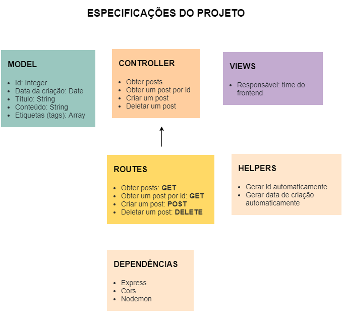

# Posts

O projeto é destinado a obter todos os posts ou apenas um único pelo id, criar novas tarefas e deletar tarefas pelo id, utilizando boas práticas e organização de pasta, seguindo o design MVC.

# Motivação

Pôr em prática os conheicmentos aprendidos sobre GET, POST e DELETE, integrantes do HTTP.

# Arquitetura

# Ferramentas utilizadas

- NodeJS
- Express
- Cors
- Nodemon
